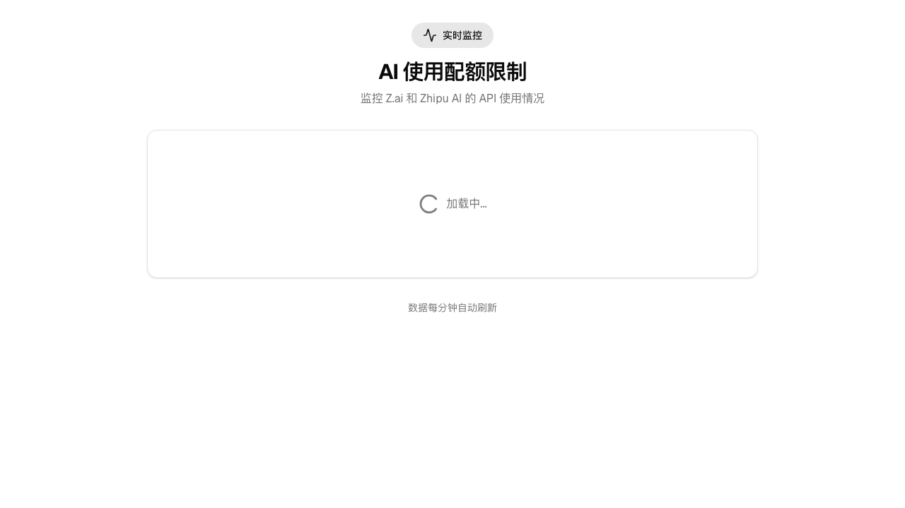

# AI Usage Quota Monitor

[](https://vercel.com/kazoottts-projects/v0-ai-usage-quota)



## 🚀 项目简介

这是一个 AI API 使用配额监控仪表盘，用于实时追踪和管理多个 AI 服务的 API 调用配额。

### 核心功能

- **实时监控**：每分钟自动刷新数据，实时显示 API 使用情况
- **多平台支持**：支持监控 Z.ai 和 Zhipu AI 两个平台
- **配额追踪**：清晰展示已使用配额和剩余配额
- **可视化展示**：使用进度条和卡片式布局直观展示数据
- **响应式设计**：完美适配桌面端和移动端

### 技术栈

- **前端框架**：Next.js (App Router)
- **UI 组件**：Radix UI + Tailwind CSS
- **部署平台**：Vercel

### 在线访问

- **生产环境**：https://usage.kazoottt.top/
- **Vercel 部署**：https://vercel.com/kazoottts-projects/v0-ai-usage-quota

## ⚙️ 环境配置

### 1. 复制环境变量示例文件

```bash
cp .env.example .env.local
```

### 2. 配置 API 密钥

在 `.env.local` 文件中填入你的 API 密钥：

```env
# Z.ai Configuration
ZAI_API_KEY=your_zai_api_key_here
ZAI_BASE_URL=https://api.z.ai

# Zhipu AI Configuration
ZHIPU_API_KEY=your_zhipu_api_key_here
ZHIPU_BASE_URL=https://open.bigmodel.cn
```

### 3. 获取 API 密钥

- **Z.ai**: 访问 [https://api.z.ai](https://api.z.ai) 获取 API 密钥
- **Zhipu AI**: 访问 [https://open.bigmodel.cn](https://open.bigmodel.cn) 获取 API 密钥

> 注意：至少配置其中一个 API 密钥才能正常使用。

## 📦 安装与运行

### 安装依赖

```bash
pnpm install
```

### 本地开发

```bash
pnpm dev
```

访问 [http://localhost:3000](http://localhost:3000)

### 构建生产版本

```bash
pnpm build
pnpm start
```

## 📄 许可证

MIT